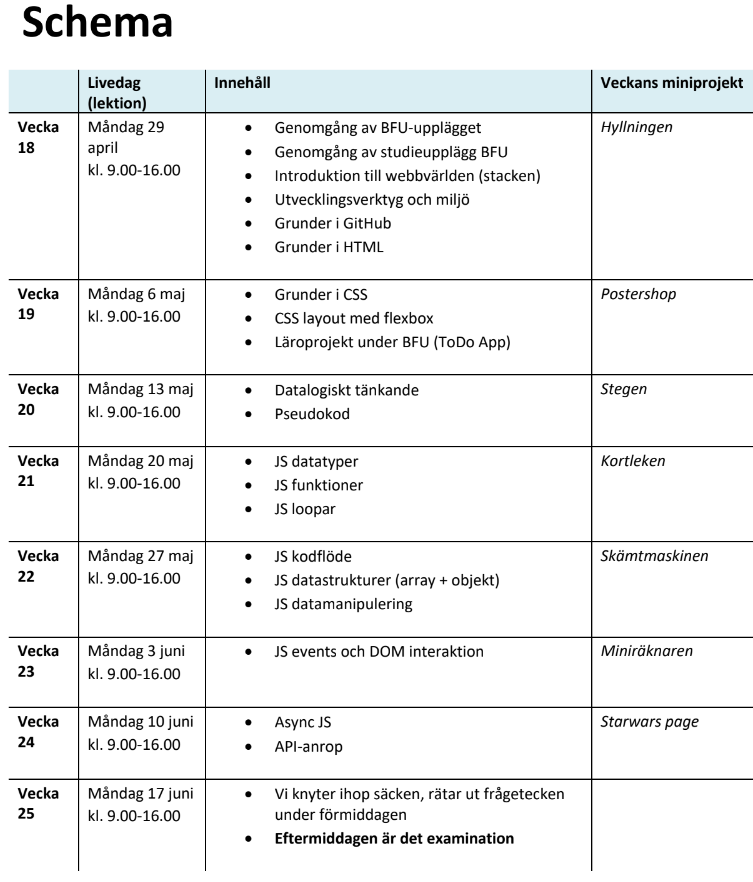

# 2024-05-27
Lektion vecka 5, JavaScript funktioner och datastrukturer

## Material
+ [Övningar](exercises.md)
+ Presentation: [06 Funktioner](https://docs.google.com/presentation/d/1wG-yV6x662Gzz6gOHnxxcN-ATD8aODGCMq-zn-N3dAE/edit?usp=sharing)

Veckoprojekt
+ projektet - länk kommer
+ inlämning - länk kommer

Inspelning
+ Länk till inspelning av lektionen - kommer

## Resurser

[Installera Node.js](https://nodejs.org/en/download/prebuilt-installer) - Välj version 20, LTS

[Skriv JavaScript online](https://replit.com/) | replit.com

[Koda med Blockly](https://lejonmanen.github.io/learn-code-blockly/) - bygg kod genom att dra block i stället för att skriva.

[JavaScript tutorials](https://www.youtube.com/playlist?list=PLTjRvDozrdlxEIuOBZkMAK5uiqp8rHUax) | Programming with Mosh, YouTube

[The Modern JavaScript Tutorial](https://javascript.info/) - bra referens till JS

## Schema

